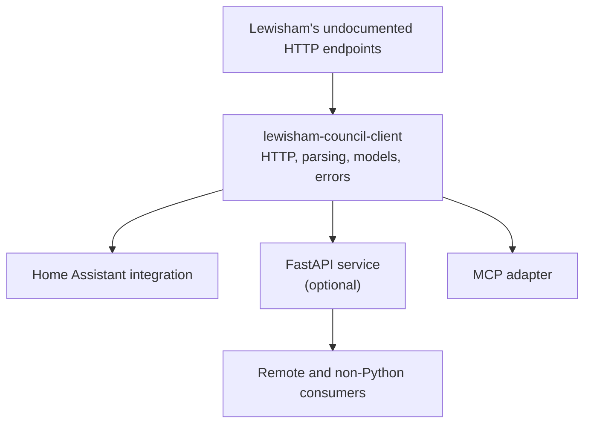

# Client-First Integration Architecture

## Relationship to Design 001

This document follows [Design 001](design_001_motivation.md). The original
motivation remains unchanged: Lewisham publishes useful civic data through a
human-facing website but does not provide a documented public API suitable for
automation.

What changes here is the integration architecture. Design 001 treated a
self-hosted REST API as the centre of the project. Subsequent investigation
showed that this should be one supported delivery mechanism rather than a
prerequisite for every consumer.

## Original API-first assumption

An API was a natural starting point for three reasons.

First, the project exists partly because an official Lewisham API ought to
exist. Providing a stable, machine-readable HTTP contract seemed like the most
direct way to fill that gap.

Second, the initial scraping assumption involved browser automation with
Selenium or Playwright. A browser process is a comparatively heavy and
specialised runtime dependency. Isolating it behind a containerised service
would have prevented every consumer from needing to install a browser, manage
its lifecycle, and understand the scraping flow.

Third, a REST boundary offered broad future compatibility. Home automation,
scripts, dashboards, conversational tools, and future civic-data modules could
all consume the same protocol without depending on Python.

Those were reasonable assumptions at the time. The API implementation also
forced useful separation between upstream access, parsing, domain models,
orchestration, caching, and transport-specific schemas.

## What changed

The scraping spike found that Lewisham's Sitecore form is backed by stateless,
undocumented HTTP endpoints. Address lookup and collection retrieval can be
performed with ordinary asynchronous HTTP requests. They do not currently
require a browser, cookies, authentication, expiring credentials, or a prior
form submission.

This makes the production capability much lighter:

- The scraper is a small Python HTTP client and parser.
- It can run safely inside another Python application.
- Consumers no longer need browser-process isolation.
- A separate service is no longer required merely to hide Selenium or
  Playwright.

The immediate Home Assistant use case makes the cost of an API-first design
particularly visible. A user interested only in their bin schedule would need
to:

1. Deploy and maintain a Docker container.
2. Configure networking between Home Assistant and that container.
3. Monitor another service and arrange its upgrades.
4. Install or configure a Home Assistant integration that calls the service.

That is disproportionate when Home Assistant can run the lightweight Python
client directly. The REST hop would translate Python domain objects into JSON
only for Home Assistant to translate them back into entities.

## Decision

The project will move towards a client-first architecture.

A framework-neutral Python package will own Lewisham data acquisition and
interpretation. Home Assistant, FastAPI, and MCP will be adapters around that
shared capability. None of those adapters should be required by another unless
an explicit deployment needs a remote process boundary.

The existing REST service remains useful and supported, but it is no longer
the default foundation for Home Assistant or local MCP use.

## Package boundaries

### `lewisham-council-client`

The client package is the reusable core. It should own:

- Asynchronous calls to Lewisham's upstream endpoints.
- Address search and exact UPRN resolution.
- Parsing of the JSON-encoded schedule HTML.
- Domain models and domain-specific exceptions.
- Council-specific orchestration needed to return a complete schedule.
- An injectable HTTP client so host applications can manage connection
  pooling and lifecycle.

It must not depend on FastAPI, Home Assistant, MCP, container conventions, or
presentation-specific schemas.

Consumer-specific scheduling and persistence should remain outside the client.
For example, Home Assistant already coordinates polling, while the REST service
may choose a TTL cache to protect the upstream across multiple callers.
Reusable cache interfaces may remain shared where they are genuinely
framework-neutral, but cache policy belongs to the consuming runtime.

### `lewisham-server`

The server becomes an optional HTTP adapter over `lewisham-council-client`. It remains
appropriate when:

- A non-Python consumer needs the data.
- Several independent processes should share one upstream cache.
- The scraper must be operated and upgraded separately from its consumers.
- A deployment needs central authentication, rate limiting, monitoring, or
  persistence.
- Future civic-data modules make a local Lewisham gateway useful in its own
  right.

The server should continue to expose a richer canonical Lewisham schema rather
than adopting the lowest-common-denominator shape of any single consumer.

Docker remains a supported packaging option for the server, not a requirement
for using the project.

### Home Assistant integration

Home Assistant should use `lewisham-council-client` directly.

The integration can provide a configuration flow that:

1. Accepts a postcode or street search.
2. Uses the client to present matching addresses.
3. Stores the selected UPRN.
4. Coordinates conservative schedule refreshes.

The resulting schedule can be represented as native date sensors for each
waste stream and a calendar entity for collection events. Frequency, weekday,
and whether a date was published or derived remain available as entity
attributes.

Home Assistant owns polling, entity availability, restoration, and UI
presentation. It should inject its managed asynchronous HTTP session into the
client rather than create a separate session for every entity.

This path gives a bin-schedule user one component to install and no additional
service to operate.

### `lewisham-mcp`

Local MCP use should also depend directly on `lewisham-council-client`. MCP is a tool
protocol and does not inherently require a REST service behind it.

An API-backed MCP deployment may still be useful when the MCP process runs on a
different machine or must share a central cache with other consumers. That is a
deployment choice rather than a package dependency.

An earlier `packages/lewisham-mcp` existed as a pre-pivot stub: it called a
REST endpoint that no longer exists and took no UPRN, so it could not work
even in principle, and it contradicted the client-first direction above. It
was removed on 2026-07-03 rather than kept as a non-functional placeholder.
Step 4 below is therefore unstarted, not in progress — a fresh
`lewisham-mcp` should be built against `lewisham-council-client` directly.

## Domain and compatibility contracts

The shared domain model is the source of truth for collection data. It retains
Lewisham-specific information such as:

- Waste type.
- Frequency.
- Collection weekday.
- Per-stream next collection date.
- Whether that date was published by Lewisham or derived from a weekly
  recurrence.
- Source and fetch provenance.

Adapters translate this model for their environments:

- FastAPI serialises it as an ISO-based JSON response.
- Home Assistant maps it to sensors, attributes, and calendar events.
- MCP presents purpose-specific tools and structured results.
- A UKBinCollectionData contribution can map it to that project's narrower
  `bins` contract without making that contract canonical here.

Compatibility formats should be added at adapter boundaries only when a real
consumer requires them.

## Alternatives considered

### Retain the API as the mandatory core

This preserves the current deployment shape but imposes a container, network
hop, and second integration on lightweight in-process consumers. Without a
browser runtime or shared operational requirement, that cost is not justified
as the default.

### Make Home Assistant call the REST API

This remains a valid deployment option and is useful for testing the API. It
should not be the only supported Home Assistant path because it makes a
separate service mandatory for a single local use case.

### Implement scraping separately in every adapter

This avoids creating a client package but duplicates the most fragile code.
Parser drift, error handling, and upstream changes would need to be fixed
independently in Home Assistant, FastAPI, and MCP. A shared client provides the
cohesion the monorepo is intended to support.

### Stop at an upstream UKBinCollectionData contribution

Improving UKBinCollectionData is complementary and immediately benefits its
existing users. It does not replace the richer Lewisham domain model, address
resolution, MCP use, or possible future civic-data work in this project.

## Consequences

The client-first design reduces installation friction and prevents the scraper
from being coupled to one transport. It also makes the dependency direction
explicit: frameworks depend on the civic-data capability, not the other way
round.

The trade-offs are:

- The client becomes a separately versioned package boundary.
- Changes to the domain model require coordinated adapter updates.
- Home Assistant introduces its own integration tests and release concerns.
- Independent in-process consumers do not automatically share a cache.

The last point provides a clear trigger for revisiting deployment. If several
active consumers begin duplicating upstream requests, the server may then earn
its place as a shared local gateway.

## Migration path

Steps 1–3 and 6 are complete. Steps 4, 5, and 7 remain.

1. ~~Create `packages/lewisham-council-client`.~~
2. ~~Move the framework-neutral domain, upstream client, parser, and orchestration
   into it without changing observable behaviour.~~
3. ~~Make `lewisham-server` consume the client package and retain its API schemas,
   runtime settings, logging, and cache policy.~~
4. Build `lewisham-mcp` to consume the client directly for local operation
   (the earlier non-functional stub was removed; see the note above).
5. Add a Home Assistant custom integration backed by the client.
6. ~~Reposition the repository documentation so the Python client is the core and
   REST, Home Assistant, and MCP are supported modalities.~~
7. Decide public distribution independently for each modality. A PyPI client,
   HACS integration, and container image may have different release cadences.

This migration preserves the working API and its tests while removing it from
the dependency path of consumers that do not need a service boundary.

## Non-goals

- Removing or deprecating the REST API immediately.
- Reintroducing browser automation.
- Making Home Assistant-specific concepts part of the client package.
- Requiring UKBinCollectionData to depend on this project.
- Publishing every package before the boundaries have been exercised locally.
